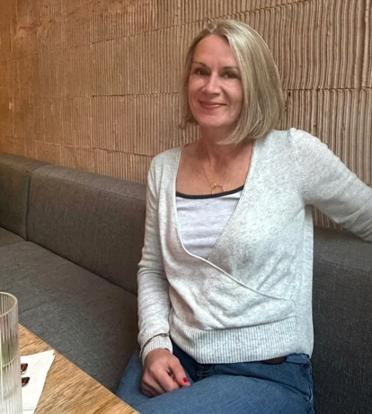

# Caroline Horsford Communications

Personal website for Caroline Horsford Communications (CHC).

## Deploying to Vercel

1. Push this repo to GitHub
2. Go to [vercel.com](https://vercel.com) → New Project → Import from GitHub
3. Select this repo — no build settings needed, just click **Deploy**

## Adding the photo

When the photo is ready, add the image file to the root of this folder (e.g. `caroline.jpg`), then open `index.html` and find this block:

```html
<div class="photo-placeholder">
  ...
</div>
```

Replace it with:

```html

```

## Contact details

- **Email:** CarolineCommsUK@protonmail.com  
- **Phone:** 07899 756527  
- **LinkedIn:** https://www.linkedin.com/in/caroline-horsford-b7670918/
